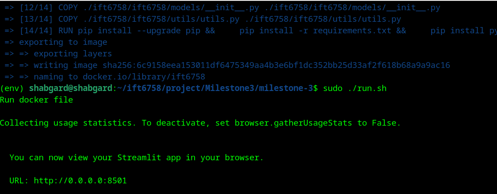

# milestone-3
# 🏒 IFT-6758 Project * NHL
[Repo URL](https://github.com/mansooraliamiri/milestone-3.git)

## Remarque : ce projet est un dérivé du projet original d'équipe de 4 personnes, leçon ift6758, sur lequel je travaille seul à partir du jalon 3. J'ai réécrit certaines parties et y ai ajouté quelques parties. Pour une meilleure compréhension, j'ai donné ci-dessous des exemples de code de projet pour une meilleure compréhension. Cette annonce est conforme aux lois de protection de la propriété intellectuelle. De plus, le ChatGPT a été utilisé pour certaines ambiguïtés.

Sources usagé:

[Repo URL](https://github.com/AxelBogos/NHL-Analytics)

[Repo URL](https://github.com/M0rph3e/ift6758-project-main)

[Repo URL](https://github.com/nrjkumar/IFT6758/tree/master)

####################################

Guide d'exécution du logiciel :
Tout d’abord, installez complètement Docker [Repo URL](https://docs.docker.com/engine/install/) . Ensuite, démarrez le script Docker à l'aide du fichier de construction 
(sudo ./build.sh).

Après cela, l'application commencera à s'exécuter en utilisant (./run.sh). Accédez au lien pour y accéder sur le navigateur Web.

